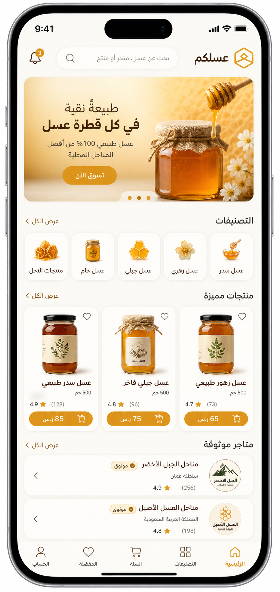
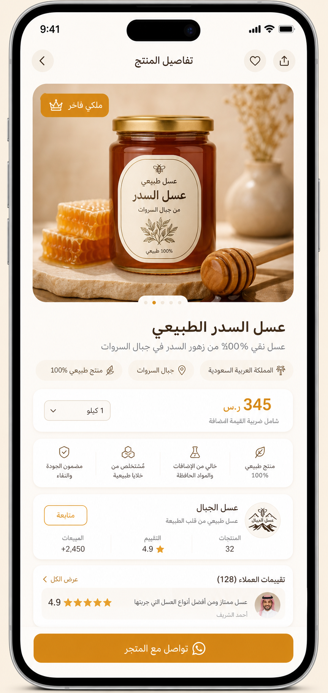
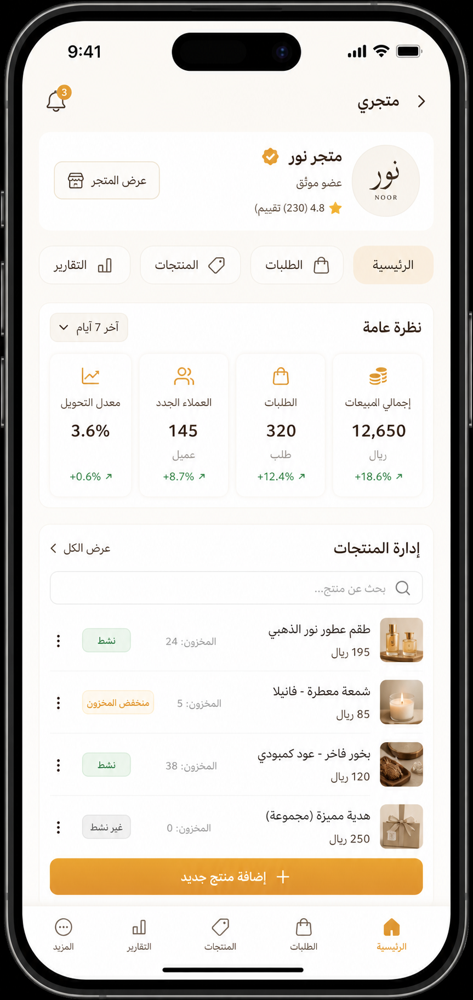
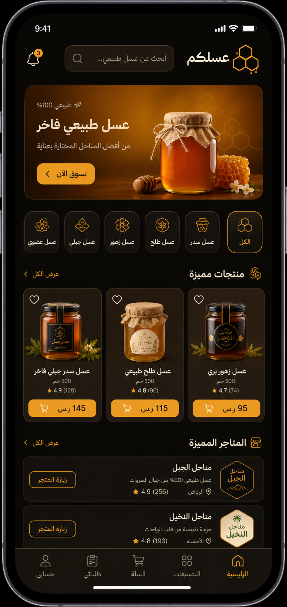
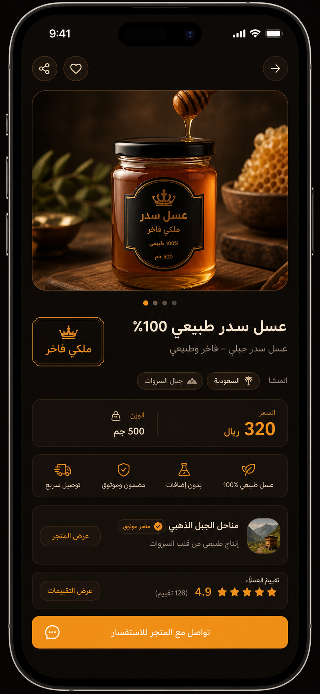
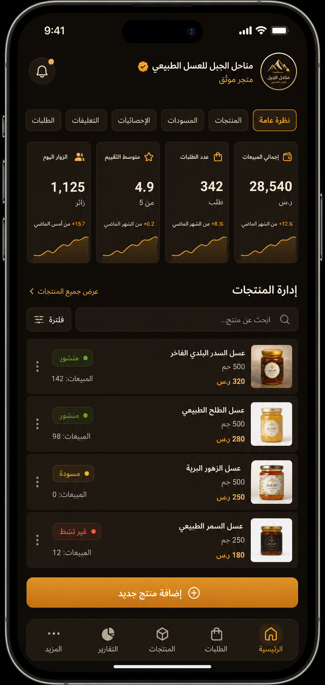
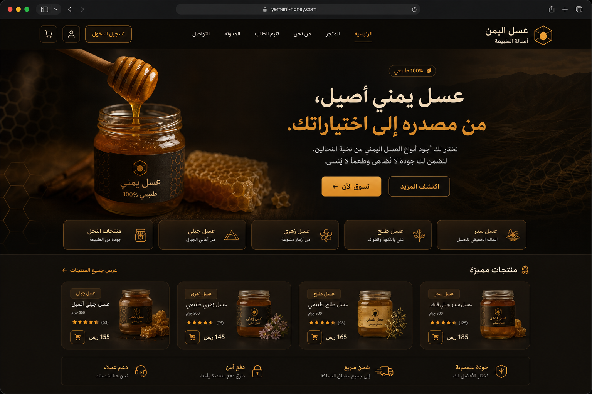

# Souq Al Assal / سوق العسل

## عسلكم — منصة العسل اليمني

هذا المستودع هو مشروع **Greenfield** لبناء منصة اجتماعية/تجارية متخصصة بالعسل اليمني. الاسم الهندسي الداخلي الثابت هو `Souq Al Assal / سوق العسل`، بينما الاسم التجاري الظاهر للمستخدم في التطبيق والويب هو **عسلكم**.

## مخرجات المشروع

يحتوي المشروع على ثلاثة مخرجات مستقلة ومترابطة بعقود دلالية مشتركة:

| المخرج | المسار | نطاق التشغيل |
|---|---|---|
| تطبيق الجوال | `apps/mobile_flutter` | Flutter/Dart، عربي أولًا وRTL، Demo-First ثم مصدر إنتاج |
| لوحة Admin | `apps/admin_web` | Web محلية التشغيل، عربية RTL، صلاحيات إدارية وسجل تدقيق |
| صفحة الهبوط | `apps/landing_web` | Web عامة، عربية RTL، مهيأة للنشر على Cloudflare |

وتوجد عقود الويب وعقود Flutter في `packages/contracts_ts` و`packages/contracts_dart` عند الحاجة، مع الحفاظ على التطابق الدلالي وعدم فرض TypeScript على تطبيق Flutter.

## القواعد التنفيذية الملزمة

يعمل التطوير وفق **Demo-First Architecture** و**Repository Abstraction**. لا تتصل أي Widget أو Screen مباشرة بـ Supabase. المسار المعتمد هو:

```text
UI → ViewModel / Controller → Use Case → Repository Interface → Demo Repository أو Supabase Repository → Data Source
```

Supabase هو مصدر الإنتاج الرسمي للبيانات والمصادقة والتخزين، لكنه ليس شرطًا لتشغيل أو اختبار Demo Mode. لا يقود Schema أو RLS أو Backend APIs تجربة المستخدم أو Domain Model قبل استقرار عقود Demo.

كل Feature مكتملة يجب أن تجمع بين UI وState وDomain Behavior وRepository Contract وDemo Implementation وDemo Data وحالات Loading/Empty/Error والاختبارات والأدلة، ثم Production Data Source عند مرحلة التكامل. لا توجد واجهات ميتة أو handlers فارغة.

## المراجع والسلطة

المرجع الأعلى للتنفيذ هو `docs/execution-authority.md`، وتفاصيل Phase 1 في `docs/phase-01-plan.md`. سجل الأصول المرجعية في `docs/reference-manifest.md`. لا تُستخدم الصور المرجعية كمصدر معماري، ولا تُستخدم بيانات Honey Master كمصدر تلقائي للأسعار أو المخزون أو الإحصاءات.

## واجهة عسلكم الجديدة — Premium Beige & Dark Honey

انسخ أحدث إعادة بناء للواجهة بالكامل على **Presentation/Frontend فقط**. الافتراضي هو **البيج الدافئ القريب من الأبيض**، والوضع **الليلي الداكن العسلي** اختياري من الإعدادات. لم يتم تغيير أي Backend أو قاعدة بيانات أو Schema أو RLS أو Auth أو منطق عمل.

| الوضع | الخلفية | البطاقات | اللمسة | النص |
|---|---|---|---|---|
| الافتراضي — Beige | `#FBF8F2` | أبيض `#FFFFFF` | عسلي `#D79A2B` | بني داكن `#342118` |
| ليلي — Dark | `#0D0906` | بني دافئ `#1A120C` | ذهبي `#F5A623` | كريمي `#F7EDE2` |

### معرض الصور التوضيحية

> [افتح معرض التصميم الكامل →](./docs/design-previews/README.md)

| الصورة | المعاينة |
|---|---|
| عسلكم — الرئيسية (بيج) |  |
| عسلكم — المنتج (بيج) |  |
| عسلكم — التاجر (بيج) |  |
| عسلكم — الرئيسية (داكن) |  |
| عسلكم — المنتج (داكن) |  |
| عسلكم — التاجر (داكن) |  |
| عسلكم — الهبوط/الويب (داكن) |  |

### أدلة الجودة والمراجعة

- `UI_RECONSTRUCTION_FINAL_REPORT.md` — التقرير الختامي لإعادة البناء.
- `UI_QA_AUDIT_REPORT.md` — مراجعة الجودة ومطابقة العقود/قواعد البيانات.
- `UI_FINAL_ACCEPTANCE_MATRIX.md` — معايير القبول النهائية.
- `UI_GAP_REGISTER.md` — سجل الفجوات (منها GAP-021: لا SDK لتحليل Flutter هنا).

## حالة التنفيذ

المرحلة الحالية: **Phase 1 — تأسيس المشروع والحوكمة**.

لا يُسمح بالانتقال إلى المرحلة التالية قبل اجتياز التسلسل:

```text
PLAN → IMPLEMENT → RUN → VERIFY → TEST → VISUAL CHECK → ARCHITECTURE CHECK → FIX → RETEST → EVIDENCE → GIT COMMIT → ACCEPTANCE GATE
```
