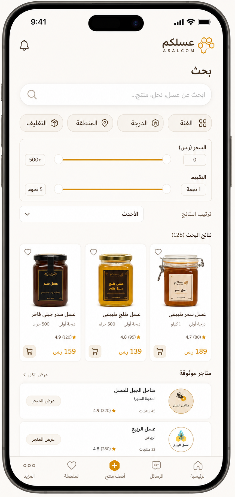
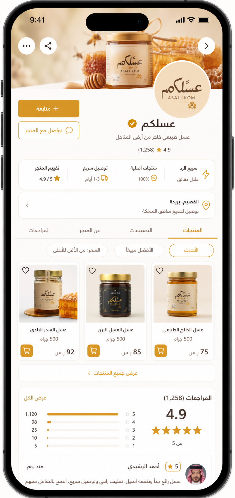
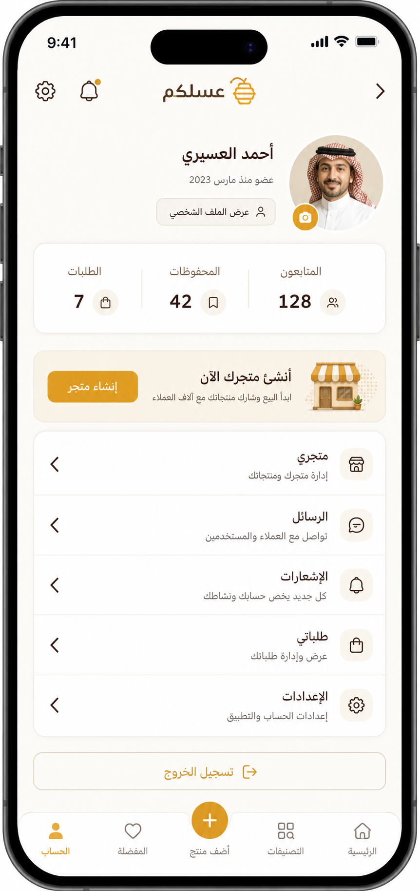
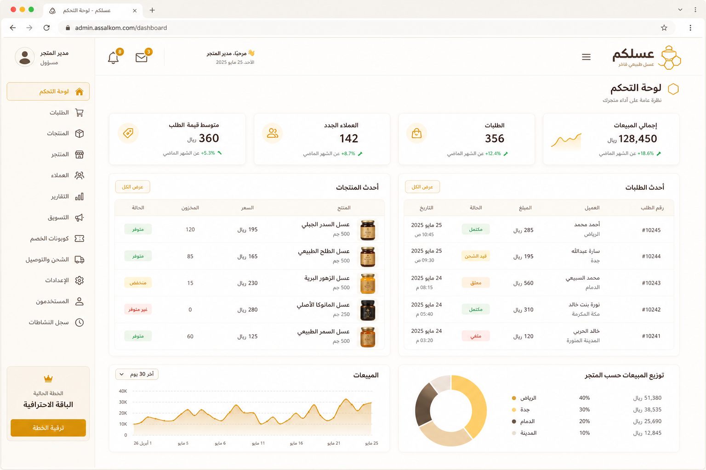
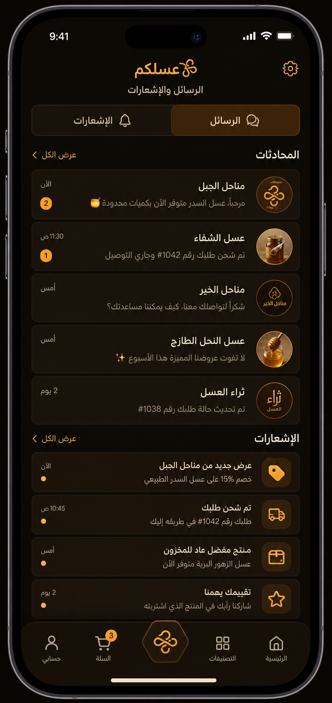
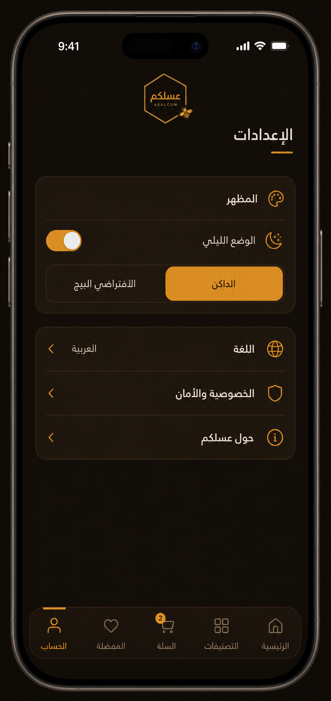

# معرض تصميم عسلكم — Premium Beige & Dark Honey

هذا المعرض يوضح **فن الواجهة الجديدة** (الوضعان) المطبّق الآن في التطبيق. الصور توضيحية بنفس هوية التصميم:

- **الافتراضي:** بيج دافئ قريب من الأبيض (`#FBF8F2`) — بطاقات بيضاء، لمسات عسلية `#D79A2B`، نص بني داكن `#342118`.
- **الليلي (اختياري من الإعدادات):** داكن عسلي ممتاز (`#0D0906`) — أسطح بنية دافئة `#1A120C`، ذهبي `#F5A623`، نص كريمي `#F7EDE2`.

> ملاحظة: تُولَّد الصور التوضيحية لتعكس **فن الواجهة** وليست لقطات شاشة حية. تبقى البيانات والوظائف مبنية على العقود والمستودعات الحالية فقط — بلا بيانات دخيلة.

## الوضع الافتراضي — Beige Honey ✅

### الرئيسية / Mobile

### صفحة المنتج / Mobile

### البحث والفلاتر / Mobile

### صفحة المتجر / Mobile

### الحساب والملف الشخصي / Mobile

### لوحة التاجر / Mobile

### لوحة الإدارة / Web

## الوضع الليلي — Dark Honey (من الإعدادات) 🌙

### الرئيسية / Mobile

### صفحة المنتج / Mobile

### لوحة التاجر / Mobile

### المراسلات والإشعارات / Mobile

### الإعدادات ومبدّل المظهر / Mobile

### الهبوط والويب / Desktop

## كيفية التبديل

- **الافتراضي = البيج** (عند تشغيل التطبيق مباشرة).
- من **الإعدادات ← المظهر**: فعّل «الوضع الليلي» أو اختر «الدخان/الداكن» من الخيارات.

## مصطلحات الألوان

| Token | Beige (افتراضي) | Dark (ليلي) |
|---|---|---|
| `background` | `#FBF8F2` | `#0D0906` |
| `surface` | `#FFFFFF` | `#1A120C` |
| `surfaceVariant` | `#F5EEE3` | `#24180F` |
| `surfaceRaised` | `#FFFFFF` | `#2B1D12` |
| `primary` | `#B86A10` | `#F5A623` |
| `primaryLight` | `#D79A2B` | `#FFC45E` |
| `textPrimary` | `#342118` | `#F7EDE2` |
| `textSecondary` | `#806B5A` | `#C9B6A3` |
| `border` | `#E5DACB` | `#38291D` |

## الطاقة الحالية

- **الوضع الافتراضي (بيج)** يبدأ التشغيل به.
- **الوضع الليلي (داكن)** يُفعّل من الإعدادات ويؤثر على كامل التطبيق.
- لا تغيير على Backend / DB / Schema / RLS / Auth / منطق العمل.
